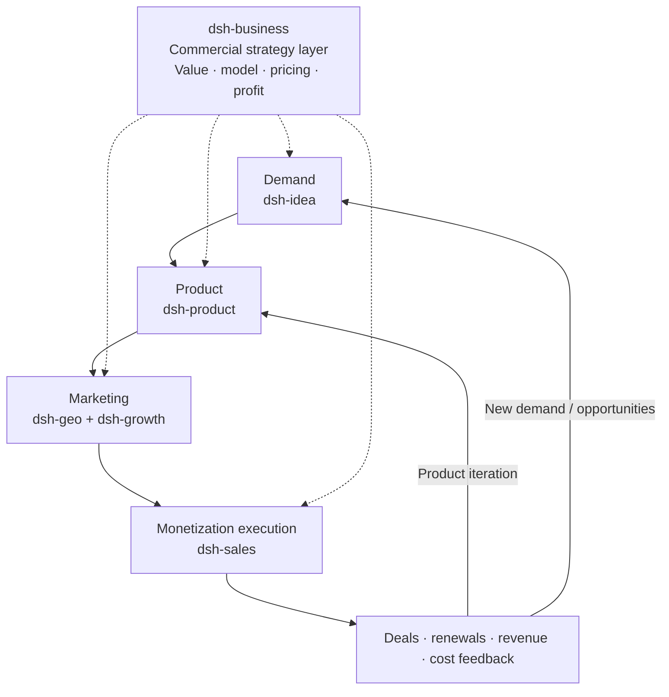

# dsh-product

`dsh-product` is a web-aware DeepSeek Harness plugin that combines public internet research with local product context to turn a validated opportunity handoff into a shippable, observable and iterated product.

Its workflow is:

```text
Demand → Product → Marketing → Monetization → Product iteration / new opportunity discovery
```

It complements `dsh-idea` and `dsh-growth`:

- `dsh-idea` owns demand and opportunity discovery.
- `dsh-product` owns product definition, feasibility, delivery gates and PMF evidence.
- `dsh-business` owns the cross-cutting commercial strategy: value, business model, pricing and profitability.
- `dsh-geo` and `dsh-growth` own the marketing stage: discoverability, acquisition, activation and growth operations.
- `dsh-sales` owns monetization execution: qualification, closing, expansion and renewal.

## 插件定位与协作导航

`dsh-product` 是六插件体系里的“产品交付与 PMF 层”：把已经有证据支持的机会，转成能交付、能观察、能迭代的产品，并用 PMF 证据决定继续、调整或暂停。

- **主责：** 产品策略、用户/问题定义、POC、MVP、Beta/发布门槛、PMF 复盘和增长交接。
- **主要输入：** [dsh-idea](../dsh-idea/README.md) 的机会交接、用户与场景证据，以及 [dsh-business](../dsh-business/README.md) 的商业约束和 [dsh-growth](../dsh-growth/README.md) 的行为数据。
- **主要输出：** 产品 Brief、范围边界、验证计划、发布检查、PMF 评审和增长 handoff，供商业化、销售和增长继续使用。
- **不负责：** 不替代机会发现、定价与盈利设计、销售跟进、增长运营或网站内容执行；代码/设计文件/CRM 记录也不由本插件直接创建。

## Positioning Architecture: Commercial Strategy Layer + Four-Stage Core Flow

The six plugins work together to turn a real demand signal into a deliverable product, reach target customers through marketing, and use monetization results to drive product iteration or discover new opportunities.



This plugin owns the product stage: after [dsh-idea](../dsh-idea/README.md) proves that a problem is worth testing, it defines what to build, how small to start and how to measure the result. [dsh-business](../dsh-business/README.md) supplies commercial constraints; [dsh-geo](../dsh-geo/README.md) and [dsh-growth](../dsh-growth/README.md) take the product into marketing; and [dsh-sales](../dsh-sales/README.md) returns close, loss, renewal and unmet-need evidence.

## Plugin Navigation

| Plugin | Clear responsibility | Direct link |
| --- | --- | --- |
| dsh-idea | External opportunities, demand signals, candidate directions and smallest useful tests | [README](../dsh-idea/README.md) |
| dsh-product | Product definition, POC/MVP, release gates and PMF (this plugin) | [README](./README.md) |
| dsh-business | Cross-cutting commercial strategy, value, pricing and profitability | [README](../dsh-business/README.md) |
| dsh-sales | Monetization execution: qualification, deal progression, closing, expansion and renewal | [README](../dsh-sales/README.md) |
| dsh-growth | Acquisition, activation, retention, revenue analysis and growth experiments | [README](../dsh-growth/README.md) |
| dsh-geo | SEO/GEO/AEO, content production and search/answer-engine discoverability | [README](../dsh-geo/README.md) |

## Recommended Handoffs

| Output from this plugin | Hand off to | Handoff question |
| --- | --- | --- |
| Product brief, POC/MVP scope and user-value evidence | [dsh-business](../dsh-business/README.md) | How should we package and price it, and can the unit economics work? |
| PMF review, behavior data and core usage contexts | [dsh-growth](../dsh-growth/README.md) | Which funnel, retention or revenue lever should we test first? |
| Confirmed value proposition, capability boundaries and sales inputs | [dsh-sales](../dsh-sales/README.md) | Which customers are worth pursuing and how should we progress the deal? |
| Product language, user problems and release content | [dsh-geo](../dsh-geo/README.md) | How can target users discover the product through search and answer engines? |

The plugin reads local Markdown and bounded CSV/JSON/JSONL evidence, can query public product information, preserves lineage and uses preview-plus-confirmation for file writes. Web research does not automatically send local files, cookies or login state to a provider. It does not create code, design files, CRM records or external campaigns.

See [README.zh.md](./README.zh.md) for the Chinese workflow and examples.
