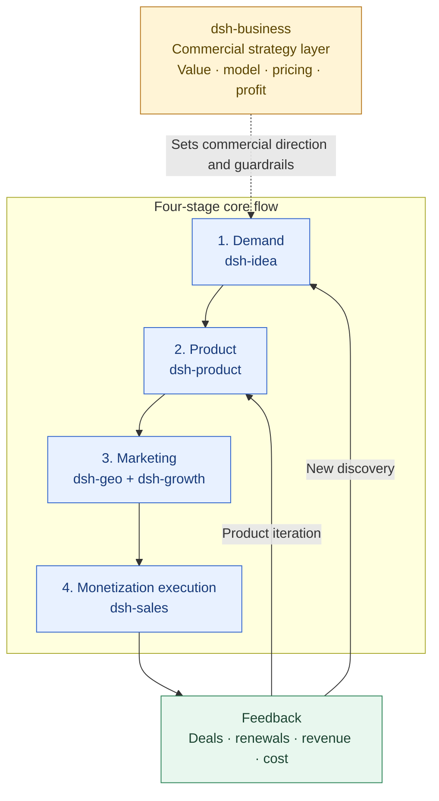

# dsh-product

English | [中文](./README.zh.md)

`dsh-product` 是一个“互联网资讯查询 + 本地项目上下文”的 DeepSeek Harness 插件，用于把已经确认的产品机会转化为可验证、可交付、可迭代的产品。

`dsh-product` is a web-aware DeepSeek Harness plugin that combines public internet research with local product context to turn a validated opportunity handoff into a shippable, observable and iterated product.

Its workflow is:

```text
Demand → Product → Marketing → Monetization → Product iteration / new opportunity discovery
```

It complements `dsh-idea` and `dsh-growth`:

- `dsh-idea` owns demand and opportunity discovery.
- `dsh-product` owns product definition, feasibility, delivery gates and PMF evidence.
- `dsh-business` owns the cross-cutting commercial strategy: value, business model, pricing and profitability.
- `dsh-geo` and `dsh-growth` own the marketing stage: discoverability, acquisition, activation and growth operations.
- `dsh-sales` owns monetization execution: qualification, closing, expansion and renewal.

## Plugin Positioning and Collaboration Navigation

`dsh-product` is the product-delivery and PMF layer in the six-plugin system. It turns an evidence-backed opportunity into a shippable, observable and iterated product, using PMF evidence to decide whether to continue, adjust or pause.

- **Owns:** Product strategy, user/problem definition, POC, MVP, beta/release gates, PMF reviews and growth handoffs.
- **Inputs:** Opportunity handoffs and user/context evidence from [dsh-idea](../dsh-idea/README.md), commercial constraints from [dsh-business](../dsh-business/README.md) and behavior data from [dsh-growth](../dsh-growth/README.md).
- **Outputs:** Product briefs, scope boundaries, validation plans, release checks, PMF reviews and growth handoffs for commercial strategy, sales and growth.
- **Does not own:** Opportunity discovery, pricing/profitability design, sales follow-up, growth operations or website content execution. It does not create code, design files or CRM records.

## Positioning Architecture: Commercial Strategy Layer + Four-Stage Core Flow

The six plugins work together to turn a real demand signal into a deliverable product, reach target customers through marketing, and use monetization results to drive product iteration or discover new opportunities.



This plugin owns the product stage: after [dsh-idea](../dsh-idea/README.md) proves that a problem is worth testing, it defines what to build, how small to start and how to measure the result. [dsh-business](../dsh-business/README.md) supplies commercial constraints; [dsh-geo](../dsh-geo/README.md) and [dsh-growth](../dsh-growth/README.md) take the product into marketing; and [dsh-sales](../dsh-sales/README.md) returns close, loss, renewal and unmet-need evidence.

## Plugin Navigation

| Plugin | Clear responsibility | Direct link |
| --- | --- | --- |
| dsh-idea | External opportunities, demand signals, candidate directions and smallest useful tests | [README](../dsh-idea/README.md) |
| dsh-product | Product definition, POC/MVP, release gates and PMF (this plugin) | [README](./README.md) |
| dsh-business | Cross-cutting commercial strategy, value, pricing and profitability | [README](../dsh-business/README.md) |
| dsh-sales | Monetization execution: qualification, deal progression, closing, expansion and renewal | [README](../dsh-sales/README.md) |
| dsh-growth | Acquisition, activation, retention, revenue analysis and growth experiments | [README](../dsh-growth/README.md) |
| dsh-geo | SEO/GEO/AEO, content production and search/answer-engine discoverability | [README](../dsh-geo/README.md) |

## Recommended Handoffs

| Output from this plugin | Hand off to | Handoff question |
| --- | --- | --- |
| Product brief, POC/MVP scope and user-value evidence | [dsh-business](../dsh-business/README.md) | How should we package and price it, and can the unit economics work? |
| PMF review, behavior data and core usage contexts | [dsh-growth](../dsh-growth/README.md) | Which funnel, retention or revenue lever should we test first? |
| Confirmed value proposition, capability boundaries and sales inputs | [dsh-sales](../dsh-sales/README.md) | Which customers are worth pursuing and how should we progress the deal? |
| Product language, user problems and release content | [dsh-geo](../dsh-geo/README.md) | How can target users discover the product through search and answer engines? |

`product_sales_handoff` emits the versioned `product-sales-handoff` contract only after a `proceed` or `scale` product decision. It carries value evidence, proof points, delivery boundaries and commercial dependencies to `dsh-sales`; it never sets a price or expands the product promise.

Use the `commercialContext` field to attach a `dsh-business` `commercial-handoff` or its source path. Product scope and packaging may use those constraints, but they remain separate from demand and PMF evidence.

The plugin reads local Markdown and bounded CSV/JSON/JSONL evidence, can query public product information, preserves lineage and uses preview-plus-confirmation for file writes. Web research does not automatically send local files, cookies or login state to a provider. It does not create code, design files, CRM records or external campaigns.

See the [Chinese README](./README.zh.md) for the Chinese workflow and examples.
