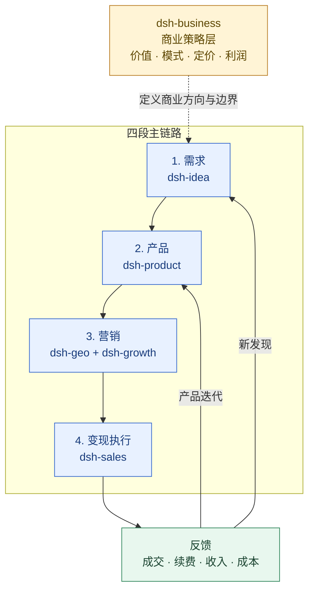

# 产品落地（dsh-product）

中文 | [English](./README.md)

`dsh-product` 是一个“互联网资讯查询 + 本地项目上下文”的 DeepSeek Harness 插件，用于把已经确认的产品机会转化为可验证、可交付、可迭代的产品。

它不替代 `dsh-idea` 的需求发现，也不替代 `dsh-sales` 的成交推进或 `dsh-growth` 的增长与收入分析。

## 定位：产品交付与 PMF 层

> `dsh-idea` 负责需求与机会，`dsh-product` 负责产品，`dsh-geo` 与 `dsh-growth` 负责营销，`dsh-sales` 负责变现执行，`dsh-business` 负责贯穿全链路的商业策略。

## 定位架构：商业策略层 + 四段主链路



`dsh-product` 负责把已验证的需求变成可交付、可观察、可迭代的产品，并接收营销与变现过程中的产品反馈。

## 插件导航

| 插件 | 分工 | 直接跳转 |
|---|---|---|
| `dsh-idea` | 外部机会、需求信号、候选方案和最小验证 | [README](../dsh-idea/README.zh.md) |
| `dsh-product` | 产品定义、POC/MVP、发布门槛和 PMF | [README](./README.zh.md) |
| `dsh-business` | 横跨全链路的商业策略、价值、定价和盈利 | [README](../dsh-business/README.zh.md) |
| `dsh-sales` | 变现执行：资格判断、商机推进、成交、扩单和续约 | [README](../dsh-sales/README.zh.md) |
| `dsh-growth` | 获客、激活、留存、收入分析和增长实验 | [README](../dsh-growth/README.zh.md) |
| `dsh-geo` | SEO/GEO/AEO、内容生产和搜索/答案引擎可发现性 | [README](../dsh-geo/README.zh.md) |

## 核心能力

- 产品 Brief：目标、价值主张、成功标准、约束和非目标。
- POC：技术、工作流、价值、运营和合规风险；每个风险绑定测试与成功/失败阈值。
- MVP：最小范围、明确不做、用户流程、验收标准、埋点和成功指标。
- PRD：把 MVP 计划渲染为可评审的 Markdown 交付文档。
- Beta/发布检查：按证据区分通过、带条件、阻塞和暂未检查。
- 产品决策门：明确继续、调整、暂缓、放弃或扩大投入；缺证据只会暂缓，不会被误判为失败。
- PMF 复盘：按分群观察价值感知、使用强度、留存、付费/续费和推荐信号，不输出单一 PMF 分数。
- 产品复盘：检查当前阶段、缺口、证据来源和下一步最小动作。
- 互联网资讯查询：查询产品方法、技术可行性、竞品、市场背景、法规、定价和发布动态，并保留可核验来源。
- 公开来源扫描：打开用户明确提供的官方文档、发布说明、标准或竞品页面，生成有长度边界的证据快照。
- 销售 / 增长交接：输出产品结果、价值证据、主指标、护栏指标、未决问题和建议动作，分别交给 `dsh-sales` 与 `dsh-growth`。
- 预览后安全写回 Markdown，使用路径边界和版本保护。

## 工具

| 工具 | 用途 |
|---|---|
| `product_onboarding` | 检查产品项目当前处于哪一关以及最重要的缺口 |
| `product_audit_note` | 审计单个产品文档的阶段、元数据和证据链 |
| `product_research` | 查询互联网资讯并返回来源、摘要、发布时间和证据边界 |
| `product_source_scan` | 扫描明确提供的公开 URL，提取有限页面快照 |
| `product_brief` | 从已确认机会生成产品 Brief |
| `product_poc_plan` | 生成针对最高风险的 POC 计划 |
| `product_mvp_plan` | 定义 MVP 范围、流程、验收、埋点和指标 |
| `product_prd` | 将 MVP 计划渲染为 PRD |
| `product_release_check` | 判断 Beta/发布是否可以继续、带条件继续或暂停 |
| `product_pmf_review` | 从本地 CSV/JSON/JSONL 复盘 PMF 证据 |
| `product_decision_review` | 按显式决策门判断继续、调整、暂缓、放弃或扩大投入 |
| `product_growth_handoff` | 生成产品到增长的交接包 |
| `product_review` | 运行完整产品落地复盘，可选接入 PMF 数据 |
| `product_report` | 生成可分享的产品落地 Markdown 报告 |
| `product_apply` | 预览后安全写回产品 Markdown |

## PMF 口径

PMF 不被压缩成一个分数。插件会分别报告：

- 价值感知，例如 `very_disappointed`、`would_miss` 或 `value_signal`；
- 使用强度，例如活跃天数、会话数或使用频率；
- 留存或持续使用；
- 付费、成交或续费；
- 推荐或传播；
- 不同用户分群之间是否收敛。

“40% 非常失望”只作为 PMF Survey 的启发式参考，不是行业基准，也不是 PMF 判定标准。缺少时间窗口、抽样方式和分群定义时，结果会明确保留限制。

## 推荐使用顺序

### 0. 先查当前资讯，再做产品判断

```text
查询这个产品方向最近的技术方案、官方发布动态和竞品定价，只保留可核验来源，区分事实、推断和未知项；不要把搜索热度当成需求证明。
```

如搜索结果出现官方文档、原始研究或公开定价页面，再使用 `product_source_scan` 打开具体 URL。互联网查询可以补充产品判断，但不会自动把本地项目文件发送给网络提供方。

### 1. 再检查项目准备度

```text
检查我的产品项目准备度，只告诉我当前处于哪一关、缺什么证据和接下来最小动作；不要重新做需求发现。
```

### 2. 从机会交接生成 Brief

```text
将这个已经确认的机会整理成产品 Brief。
产品名：……
产品目标：……
目标用户：……
期望结果：……
价值主张：……
成功标准：……
不要重新做需求发现。
```

### 3. 先做 POC，再定义 MVP

```text
为这个产品列出技术、工作流和价值风险，按影响 × 可能性排序，并生成最小 POC 计划。
```

```text
根据已经通过 POC 的方向定义 MVP，明确 in-scope、out-of-scope、用户流程、验收标准、埋点和成功指标。
```

### 4. 运行发布和 PMF 复盘

```text
检查 beta-1.0 的发布条件，区分阻塞项、带条件项和已通过项。
```

```text
复盘 pmf.csv 的 PMF 证据，按 segment 区分价值、使用、留存、付费和推荐信号；不要输出单一分数。
```

### 5. 交接给增长

```text
根据产品复盘结果生成增长交接包，包含产品结果、主指标、护栏指标和未决问题；交给 dsh-growth 继续分析。
```

## 输入数据

文档建议使用 Markdown frontmatter：

```yaml
---
type: product-brief
status: active
owner: product
updated: 2026-08-20
source: opportunity-handoff.md
stage: strategy
---
```

PMF 数据支持 CSV、JSON、JSONL。常见字段包括：

```text
user_id,segment,very_disappointed,retained,paid,referred,usage_frequency
u001,team,true,true,true,true,5
```

缺少字段时，插件返回 `missing` 或 `partial`，不会把缺失值当成 0。

## 边界

- 不抓取社区、不生成需求雷达、不做 Idea 发散；这些由 `dsh-idea` 负责。
- 互联网查询面向产品阶段所需的资讯与证据，不替代 `dsh-idea` 的需求发现、痛点验证或机会排序。
- 不创建代码、设计文件、Issue 或 CRM 记录；可通过 GitHub、Figma、Asana、Airtable 等外部系统承载执行。
- 不连接真实支付、销售或广告平台；产品结果可以交给 `dsh-sales` 做成交推进，交给 `dsh-growth` 做增长和收入分析。
- 搜索和 URL 扫描只使用公开 HTTP(S) 能力，不携带 Cookie、登录态、密码或本地文件；动态、登录和被阻断页面会明确标记为不完整。
- 搜索摘要只能作为线索；关键事实、数字、时间点和法规结论必须回到原文核验。
- 本地配置根目录仍只读；写回必须先预览并明确确认。

## 配置

```yaml
defaultRoot: "<your-local-product-root>"
reportDir: .dsh-product/reports
defaultLanguage: zh-CN
defaultTimezone: Asia/Shanghai
maxResearchQueries: 5
maxResearchResults: 5
maxResearchChars: 30000
requestTimeoutMs: 30000
```

安装后先启动 Harness，再运行 `product_onboarding`。如果产品项目和增长项目共用一个 Obsidian 根目录，建议让两个插件共享 `defaultRoot`，但保持各自报告目录独立。
